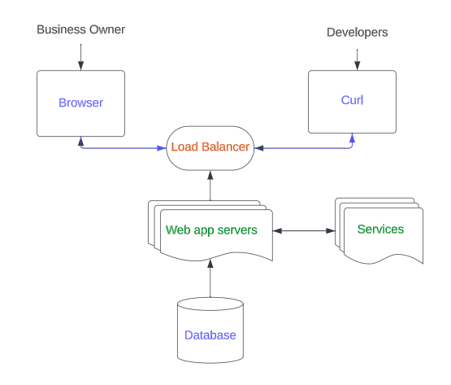
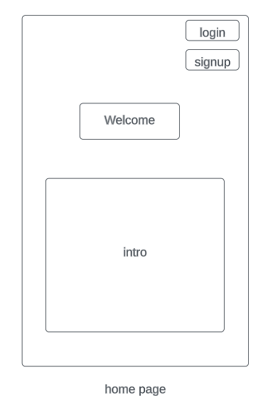
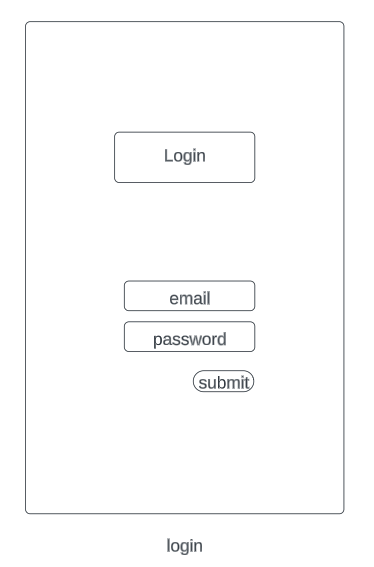
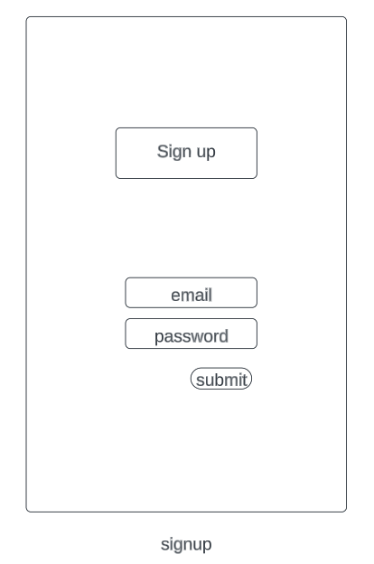
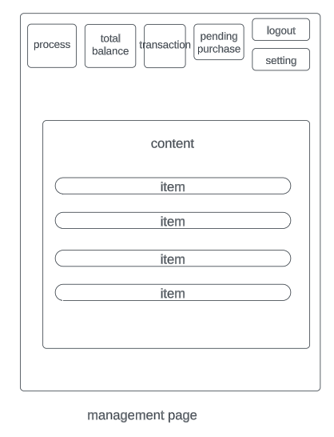

# High level design
## Application Architecture

## Wireframe UI
* Home page

* Login page

* Signup page

* Management page

## Backend modules
* Load balancer

description: The load balancer serves as the entry-point for the online payment platform, ensuring that users' requests
are evenly distributed among servers for efficient processing. It automatically
redirects traffic away 
from any malfunctioning servers to maintain a seamless and responsive user experience, regardless of traffic volume.
* Web app servers

description: The Web App Servers module serves as a versatile hub for the online payment platform, delivering a 
user-friendly interface through HTML pages and efficiently processing user requests for initiating transactions and 
generating reports. Additionally, it acts as an API gateway, routing requests to the appropriate backend services, 
thereby ensuring a seamless and reliable experience for all users, including both small business operators and software
developers.
* Services

description:The Servers module efficiently handles API requests by parsing and validating incoming data, then 
formulating and executing corresponding queries or commands with the database. It interprets the database responses 
and constructs appropriate API responses for the users, ensuring seamless and accurate transactions and data retrieval 
on the online payment platform.
* Database

description: Database stores and manages all the critical data for the online payment platform, such as transaction 
records, user accounts, and payment histories. It ensures quick and reliable data retrieval, enabling seamless 
transactions and accurate reporting for customers.Also offers a flexible foundation to build and customize payment 
applications.