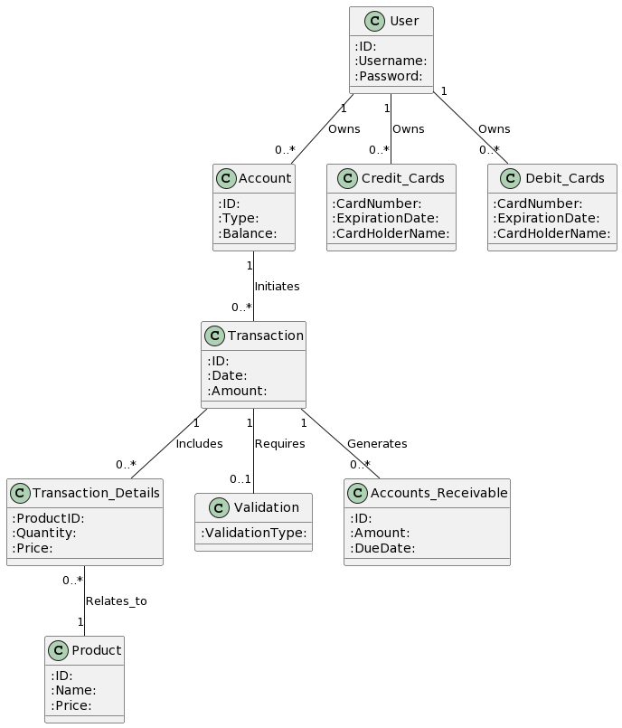

# Low level design

## Entity Relationship Diagram (ERD)

```
@startuml
!define RECTANGLE class

RECTANGLE User {
   :ID:
   :Username:
   :Password:
}

RECTANGLE Account {
   :ID:
   :Type:
   :Balance:
}

RECTANGLE Credit_Cards {
   :CardNumber:
   :ExpirationDate:
   :CardHolderName:
}

RECTANGLE Debit_Cards {
   :CardNumber:
   :ExpirationDate:
   :CardHolderName:
}

RECTANGLE Transaction {
   :ID:
   :Date:
   :Amount:
}

RECTANGLE Transaction_Details {
   :ProductID:
   :Quantity:
   :Price:
}

RECTANGLE Product {
   :ID:
   :Name:
   :Price:
}

RECTANGLE Validation {
   :ValidationType:
}

RECTANGLE Accounts_Receivable {
   :ID:
   :Amount:
   :DueDate:
}

User "1" -- "0..*" Account : Owns
User "1" -- "0..*" Credit_Cards : Owns
User "1" -- "0..*" Debit_Cards : Owns
Account "1" -- "0..*" Transaction : Initiates
Transaction "1" -- "0..*" Transaction_Details : Includes
Transaction_Details "0..*" -- "1" Product : Relates_to
Transaction "1" -- "0..1" Validation : Requires
Transaction "1" -- "0..*" Accounts_Receivable : Generates

@enduml
```



## Sequence Diagram of each ReST API

## ReST API design

## how each backend module performs its job

```
@startuml
class UserModule {
   - userId: Integer
   - username: String
   - password: String

   + createUser(): Boolean
   + authenticateUser(): Boolean
}

class AccountModule {
   - accountId: Integer
   - balance: Float

   + createAccount(): Boolean
   + updateBalance(): Boolean
   + getBalance(): Float
}

class TransactionModule {
   - transactionId: Integer
   - amount: Float

   + initiateTransaction(): Boolean
   + processTransaction(): Boolean
   + validateTransaction(): Boolean
}

class CreditCardModule {
   - cardNumber: String
   - expirationDate: Date

   + validateCard(): Boolean
}

class DebitCardModule {
   - cardNumber: String
   - balance: Float

   + validateCard(): Boolean
}

class ValidationModule {
   + checkCreditCard(): Boolean
   + checkDebitCard(): Boolean
}

class BalanceModule {
   + calculateTotalBalance(): Float
   + calculatePeriodBalance(): Float
}

class TransactionManagementModule {
   + getTransactionList(): List
   + getAccountsReceivableList(): List
}

class ProductModule {
   - productId: Integer
   - price: Float

   + createProduct(): Boolean
   + updateProduct(): Boolean
}

UserModule "1" -- "0..*" AccountModule : Manages
AccountModule "1" -- "0..*" TransactionModule : Initiates
TransactionModule "0..*" -- "1" ValidationModule : Validates
TransactionModule "0..*" -- "0..1" ProductModule : Involves
CreditCardModule "0..*" -- "1" ValidationModule : Validated by
DebitCardModule "0..*" -- "1" ValidationModule : Validated by
TransactionModule "1" -- "0..1" BalanceModule : Calculates
TransactionManagementModule "1" -- "0..1" TransactionModule : Manages
@enduml
```


